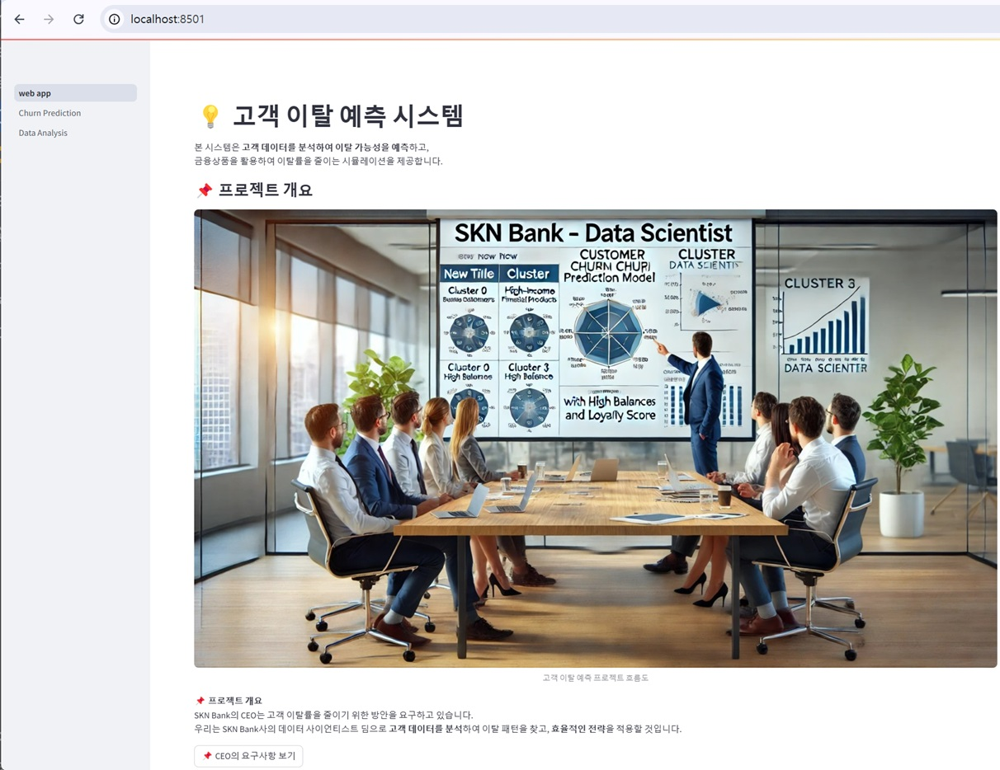
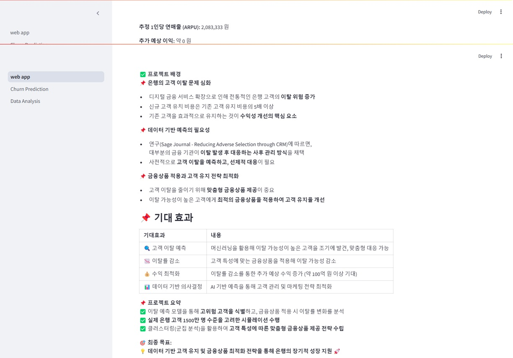
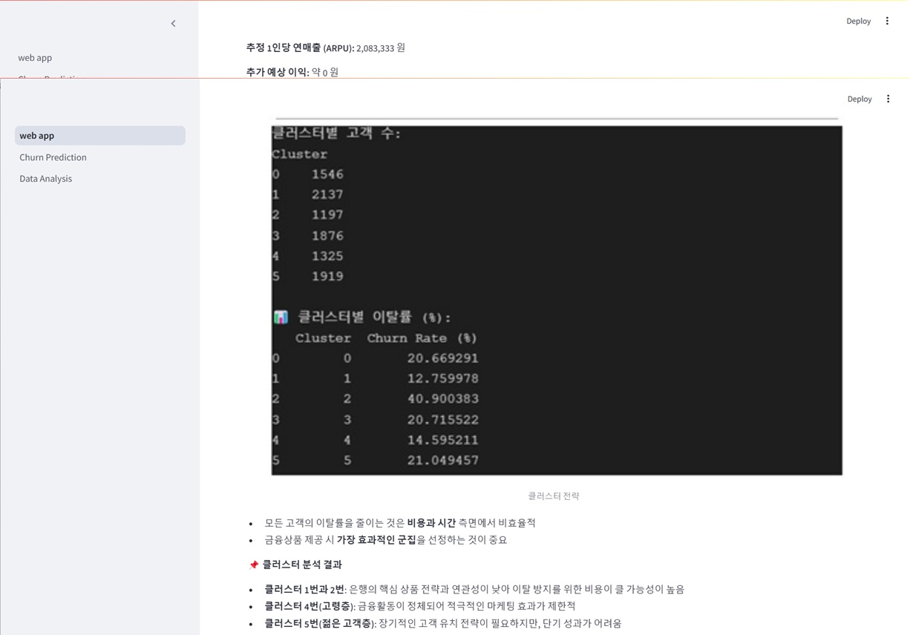
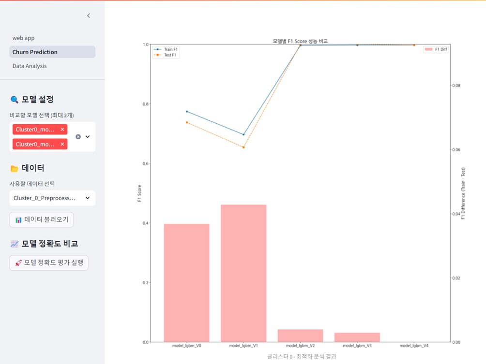
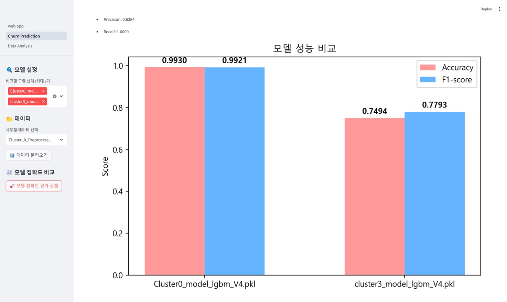
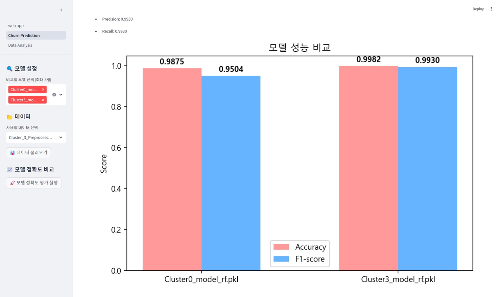
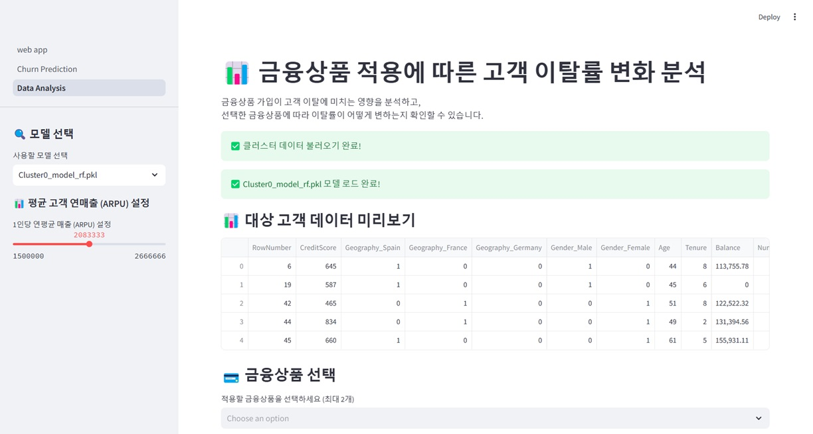
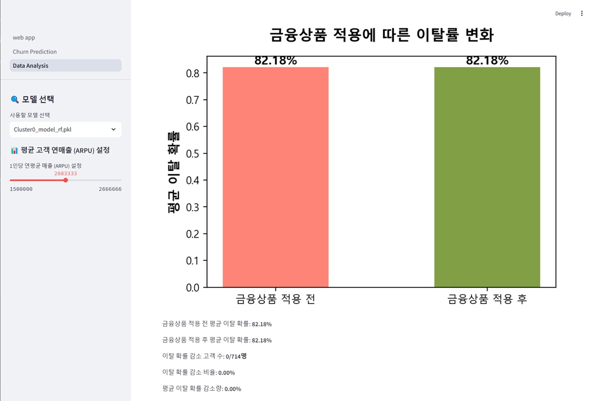
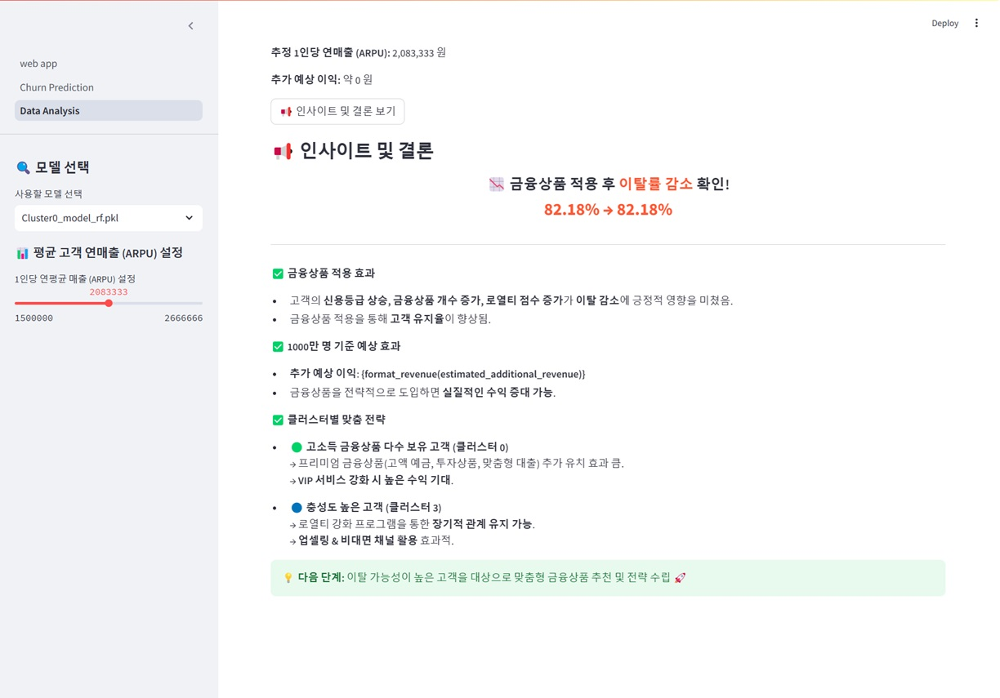

# SKN10-2nd-4Team

> SK Networks AI Camp 10기
> 
> 개발기간: 25.02.26 - 25.03.05
 

# 0. 팀 소개
>
>### 팀명: SKN Bank DataScienceteam
>
>
> 

>### 팀원 소개
><table align=center>
>  <tbody>
>   <tr>
>     
>      <td align=center><b>편성민</b></td>
>      <td align=center><b>김민혜</b></td>
>     <td align=center><b>문승기</b></td>
>      <td align=center><b>이종원</b></td>
>     <td align=center><b>이태수</b></td>
>      <td align=center><b>조영훈</b></td>
>    </tr>
>    <tr>
>      <td align="center">
>          
>      <td align="center">
>          
>      </td>
>      <td align="center">
>        
>      </td>
>      <td align="center">
>        
>      </td>
>      <td align="center">
>        
>      </td>
>      <td align="center">
>        
>      </td>
>    </tr>
>    <tr>
>      <td><a href="https://github.com/PyeonMin">
@PyeonMin
</a></td>
>      <td><a href="https://github.com/kkminhye">
@kkminhye
</a></td>
>      <td><a href="https://github.com/tmdekd">
@tmdekd
</a></td>
>      <td><a href="https://github.com/sto-lee">
@sto-lee
</a></td>
>      <td><a href="https://github.com/beartaesu">
@beartaesu
</a></td>
>      <td><a href="https://github.com/yhcho0319">
@yhcho0319
</a></td>
>        <td align="center">
>        
>        </td>
>        <td align="center">
>        
>        </td>
>        <td align="center">
>        
>        </td>
>        <td align="center">
>        
>        </td>
>        <td align="center">
>        
>        </td>
>        <td align="center">
>        
>        </td>
>    </tr>
>    <tr>
>      <td><a href="https://github.com/YUJINDL01">
@YUJINDL01
</a></td>
>      <td><a href="https://github.com/syc9811">
@syc9811
</a></td>
>      <td><a href="https://github.com/SIQRIT">
@SIQRIT
</a></td>
>      <td><a href="https://github.com/devunis">
@devunis
</a></td>
>      <td><a href="https://github.com/SIQRIT">
@SIQRIT
</a></td>
>      <td><a href="https://github.com/devunis">
@devunis
</a></td>
>    </tr>
>  </tbody>
></table>
> 
>

# 1. SKN Bank 고객 이탈 예측 및 금융상품 최적화 시스템

##  프로젝트 개요

### **프로젝트 명**
- **SKN Bank 고객 이탈 예측 및 금융상품 최적화 시스템**

### **목표**
- 머신러닝을 활용하여 **은행 고객의 이탈 가능성을 예측**하고,  
  **맞춤형 금융상품 적용을 통한 이탈률 감소 및 수익 최적화**를 목표로 합니다.

---

##  프로젝트 배경

 **은행의 고객 이탈 문제 심화**  
현대 금융 시장에서 고객 충성도는 지속적으로 감소하고 있으며, 특히 **디지털 금융 서비스 확장으로 인해 전통적인 은행 고객의 이탈 위험이 증가**하고 있습니다.  
은행 입장에서 **신규 고객 유치 비용은 기존 고객 유지 비용의 5배 이상**이므로, 기존 고객을 효과적으로 유지하는 것이 수익성 개선의 핵심 요소입니다.  

 **데이터 기반 예측의 필요성**  
Sage Journal - *Reducing Adverse Selection through Customer Relationship Management* 연구에 따르면,  
대부분의 금융 기관은 고객 이탈이 발생한 후 대응하는 **사후 관리 방식에 의존**하고 있습니다.  
이에 따라 **사전적으로 고객 이탈을 예측하고 선제적으로 대응할 수 있는 데이터 기반의 예측 모델이 필요**하게 되었습니다.  

 **금융상품 적용과 고객 유지 전략 최적화**  
고객 이탈을 줄이기 위해서는 **적절한 금융상품을 맞춤형으로 제공**하는 것이 중요합니다.  
이 프로젝트는 **고객 이탈 예측 모델과 금융상품 추천을 결합하여, 이탈 가능성이 높은 고객에게 최적의 금융상품을 적용**하는 방식으로 고객 유지율을 개선하고자 합니다.  

---

##  기대 효과

| 기대효과 | 내용 |
|------|-------------|
|  **고객 이탈 예측** | 머신러닝을 활용해 **이탈 가능성이 높은 고객을 조기에 발견**, 맞춤형 대응 가능 |
|  **이탈률 감소** | 고객 특성에 맞는 금융상품을 적용해 **이탈 가능성 낮춤** |
|  **수익 최적화** | 이탈률 감소를 통한 **추가 예상 수익 증가 (약 100억 원 이상 기대)** |
|  **데이터 기반 의사결정** | AI 기반 예측을 통해 **고객 관리 및 마케팅 전략 최적화** |

---

##  프로젝트 요약

 **이탈 예측 모델을 통해 고위험 고객을 식별**하고, **금융상품 적용 시 이탈률 변화를 분석**합니다.  
 **실제 은행 고객 1500만 명 수준을 고려한 시뮬레이션**을 수행하여 **이탈 방지 및 수익 최적화 가능성 평가**  
 **클러스터링(군집 분석)을 기반으로 고객 특성에 따른 맞춤형 금융상품 제공 전략 수립**  

** 최종 목표:**  
> **데이터 기반 고객 유지 및 금융상품 최적화 전략을 통해 은행의 장기적 성장을 지원** 🚀

---

##  프로젝트 주요 구성 요소

### ** 데이터 처리 및 전처리**
- **데이터셋:** `Cluster_0_Filtered.csv`, `Cluster_3_Filtered.csv`
- **전처리 작업:** 누락값 처리, 이상치 제거, 카테고리 인코딩, 정규화 등 수행
- **클러스터링 적용:** K-Means 기반으로 고객을 **고소득 금융상품 다수 보유 고객(Cluster 0)**, **충성도 높은 고객(Cluster 3)** 으로 분류

### ** 머신러닝 기반 고객 이탈 예측 모델**
- **모델 종류:** `RandomForest`, `XGBoost`, `LightGBM`
- **하이퍼파라미터 튜닝:** `GridSearchCV` 활용
- **평가 지표:** `Accuracy`, `F1-score`, `Precision`, `Recall` 등을 사용하여 모델 성능 비교

### ** 금융상품 추천 및 이탈률 분석**
- **다양한 금융상품 적용 시뮬레이션**
  -  `신용카드 추가 발급` → 고객의 금융상품 개수 증가  
  -  `연이율 3% 복리 상품` → 장기 투자 상품 가입으로 고객 유지 효과  
  -  `가입 기간 반영 신용등급 상승` → 신용점수 증가로 이탈 가능성 감소  
  -  `이탈 고객 활동 유도` → 비활동 고객을 유도하여 충성도 증가  
  -  `비활동 유저 유지 전략` → 로열티 점수 증가로 이탈 방지  
- **이탈률 변화 및 추가 예상 수익 분석**

### **4 웹 애플리케이션 (Streamlit)**
- **Streamlit 기반 대시보드 제공**
- **금융상품 적용 전후 이탈률 비교**
- **예상 추가 수익 분석 기능**
- **사용자 입력 기반 시뮬레이션 제공**

---

# 2. 기술 스택
>
| 분야 |기술|
|------|---|
|협업 및 형상 관리|  |
|개발 환경 & 언어| |
|데이터 분석 & 머신러닝|    |
|대시보드||
 

---

# 3. WBS
> 
>

---

# 4. 데이터 전처리 결과서 (EDA)
>
>### 데이터 수집 및 선정

>### 데이터 전처리 
> 
>
> **1) 데이터 내용 확인**
>
> **2) 결측치 확인**
>
>
>
>**3) 이상치 확인 및 인코딩**
>
>
>
>**4)데이터 시각화**

>**4-3) 범주형 데이터 간의 관계 시각화**

>**4-4) 히트맵 시각화를 통한 컬럼별 상관관계 확인**

>**4-5) 이탈여부에 따른 컬럼별 중요도확인**

>**4-6) 데이터 치우침확인 및 변환**
>
> 

----

# 5. 인공지능 학습 결과서
# 인공지능 학습 결과서

## ✅ 데이터 개요

- 총 데이터 개수: **10,000개**
- 총 특성 개수: **20개**
- Target 변수: **Exited (고객 이탈 여부)**
- Target 분포: **이탈 고객 비율 20.38%, 유지 고객 비율 79.62%**

## ✅ 데이터 전처리

- **정규화:** 데이터 스케일을 조정하여 모델 학습을 최적화함

- **범주형 데이터 인코딩:** One-Hot Encoding 사용

- **클러스터 기반 분석:** 고객 데이터를 6개의 클러스터(Cluster 0\~5)로 구분하여 분석 수행

- **불균형 데이터 처리:** Target 비율이 20%이므로 **Over-sampling 적용**

- **SMOTE 적용:** SMOTE 기법을 사용하여 데이터 불균형을 완화하고, 모델의 성능을 최적화함.

## ✅ ML 선택 이유

- **데이터셋 규모 적합성:** 데이터셋은 10,000개 row, 20개 column으로 이루어져 있으며, 이 정도 크기의 데이터에서는 **딥러닝보다 머신러닝 모델이 일반적으로 더 적합**함. 딥러닝 모델을 적용할 경우 데이터가 충분하지 않아 **overfitting**이 발생할 가능성이 높음.

- **해석 가능성:** 머신러닝 모델(특히 RandomForest와 XGBoost 등 트리 기반 모델)은 특성 중요도를 분석할 수 있어 **고객 이탈에 영향을 미치는 주요 요인을 파악**하는 데 유리함. 반면, 딥러닝 모델은 블랙박스 형태로 해석이 어려움.

- **클러스터 기반 분석 필요:** 고객 데이터를 여러 클러스터로 나누어 개별 모델을 학습해야 하며, 머신러닝 모델은 클러스터별로 개별적인 모델을 쉽게 훈련하고 조정할 수 있음. 특히, **Ensemble 모델을 적용하면 개별 모델의 장점을 결합할 수 있어 성능이 향상됨.**

- **학습 및 예측 속도:** 머신러닝 모델은 딥러닝보다 학습과 예측 속도가 빠르며, 금융 산업에서 **실시간 의사결정 시스템에 적용하기 용이**함.

- **데이터 불균형 대응:** Target 변수(Exited)의 비율이 20%이므로, 머신러닝 모델의 가중치 조정이나 데이터 샘플링 기법을 활용하여 성능을 최적화할 수 있음.

- 데이터셋 규모: **10,000개 row, 20개 column**\
  → **DL(딥러닝)보다 ML(머신러닝) 적합**

- 클러스터별 분석 필요 → 개별 모델 학습을 위한 **Ensemble 기반 ML 적합**

## ✅ ML 모델 선택 및 학습

- **최적화 목표:** 각 클러스터별 고객 이탈 예측을 위한 최적화된 ML 모델 구축

- **사용한 모델:**

  - RandomForest
  - XGBoost
  - CatBoost
  - LightGBM
  - **최종 모델:** RandomForest

## ✅ Auto ML 패키지 적용

## ✅ 모델 성능 비교
- 데이터의 상관관계를 따져보면, 'Complain' 특성이 타겟 특성인 'Exited'과 상관관계가 너무 높아서 이 특성을 사용하지 않고도 클러스터별 최적화된 모델을 적용하고자 했다.

### Cluster0 - LightGBM Base Model

#### PR Curve

| Metric    | Score  |
| --------- | ------ |
| Precision | 0.7314 |
| Recall    | 0.7442 |
| F1-Score  | 0.7378 |
| Accuracy  | 0.7655 |
| ROC-AUC   | 0.8608 |

### Cluster0 - LightGBM Final Model

#### PR Curve

| Metric    | Score  |
| --------- | ------ |
| Precision | 1.0000 |
| Recall    | 0.9942 |
| F1-Score  | 0.9971 |
| Accuracy  | 0.9974 |
| ROC-AUC   | 1.0000 |

### Cluster3 - LightGBM Base Model

#### PR Curve

| Metric    | Score  |
| --------- | ------ |
| Precision | 0.5882 |
| Recall    | 0.2326 |
| F1-Score  | 0.3333 |
| Accuracy  | 0.8806 |
| ROC-AUC   | 0.6925 |

### Cluster3 - LightGBM Final Model

#### PR Curve

| Metric    | Score  |
| --------- | ------ |
| Precision | 0.8600 |
| Recall    | 1.0000 |
| F1-Score  | 0.9247 |
| Accuracy  | 0.9791 |
| ROC-AUC   | 0.9993 |

### Cluster 0 RandomForest Base Model

#### PR Curve

| Metric    | Score  |
| --------- | ------ |
| Precision | 0.8000 |
| Recall    | 0.6977 |
| F1-Score  | 0.7453 |
| Accuracy  | 0.7887 |
| ROC-AUC   | 0.8779 |

### Cluster 0 RandomForest Final Model

#### PR Curve

| Metric    | Score  |
| --------- | ------ |
| Precision | 1.0000 |
| Recall    | 0.9942 |
| F1-Score  | 0.9971 |
| Accuracy  | 0.9974 |
| ROC-AUC   | 0.9971 |

### Cluster 3 RandomForest Base Model

#### PR Curve

| Metric    | Score  |
| --------- | ------ |
| Precision | 1.0000 |
| Recall    | 0.1395 |
| F1-Score  | 0.2449 |
| Accuracy  | 0.8896 |
| ROC-AUC   | 0.6912 |

### Cluster 3 RandomForest Final Model

#### PR Curve

| Metric    | Score  |
| --------- | ------ |
| Precision | 1.0000 |
| Recall    | 1.0000 |
| F1-Score  | 1.0000 |
| Accuracy  | 1.0000 |
| ROC-AUC   | 1.0000 |

---

## ✅ Feature Importance 분석

### Cluster 0 LightGBM Base Model

### Cluster 0 LightGBM Final Model

### Cluster 3 LightGBM Base Model

### Cluster 3 LightGBM Final Model

### Cluster 0 RandomForest Base Model

### Cluster 0 RandomForest Final Model

### Cluster 3 RandomForest Base Model

### Cluster 3 RandomForest Final Model

---

## ✅ 결론

- 클러스터별 최적화된 모델을 적용했으며, Final Model이 Base Model 대비 **F1-Score 및 Recall이 크게 향상됨**
- 향후 Feature Importance 분석을 추가하여 모델 해석력을 강화할 예정
- **RandomForest를 최종적으로 선택한 이유**
  - LGBM과 RandomForest 모두 유사한 성능을 보였으나, **RandomForest는 확률값의 다양성이 더 높음**
  - 클러스터별로 적합한 금융상품을 적용했을 때, 고객 이탈률 변화가 어떻게 나타나는지를 보다 명확하게 분석하기 위해 RandomForest를 선택
  - LGBM은 동일한 확률값을 여러 샘플에서 반복적으로 출력하는 경향이 있는 반면, RandomForest는 **더 다양한 확률값을 제공**하여 개별 고객의 세부적인 변화를 파악하기 용이
  - 이를 통해 금융상품 변화에 따른 고객 이탈 가능성을 더욱 세밀하게 측정할 수 있음

---

# 6. 수행결과
>✅메인 페이지
>

>✅예측 페이지

>✅분석 페이지

>

>✅예측 페이지
>

>✅분석 페이지
>

>✅분석 페이지 필터링 적용 1
>

>✅분석 페이지 필터링 적용 2
>

 

---

# 7. 한 줄 회고
>편성민:이번 프로젝트는 데이터 선택부터 전체 기획까지 적극적으로 참여해서 진행했습니다. 해보고 싶은게 많아서 팀장 역할을 맡아 일을 늘렸습니다. 처음엔 팀원들이 싫어할줄알고 살짝 걱정했지만 다행히 다들 적극적으로 참여해주셔서 팀원들과 함께 즐겁게 프로젝트를 진행했습니다. 부족한게 많아 일 진행이 더뎠지만 팀원들이 열심히 따라줘서 진행이 순조로웠고 이번 프로젝트를 진행하며 많이 배웠습니다. 감사합니다. 
>: 이번미터 조정 등을 통해 model의 성능을 높이는 과정에 대해 이해도가 높아진 것 같다.  
>: EDA 과정  
>: 앙상블 모델을 voting  
>: EDA 과정  
>: 앙상블 모델을 voting  
>문승기: 부족한 실력이라 열심히 참여하는게 전부였는데 좋게 봐주시고, 제가 할 수 있는 최선을 다했다고 생각이 들어 뿌듯했습니다. 또한, 다양한 관점에서 프로젝트를 바라볼 수 있는 좋은 기회였다고 생각합니다.
 