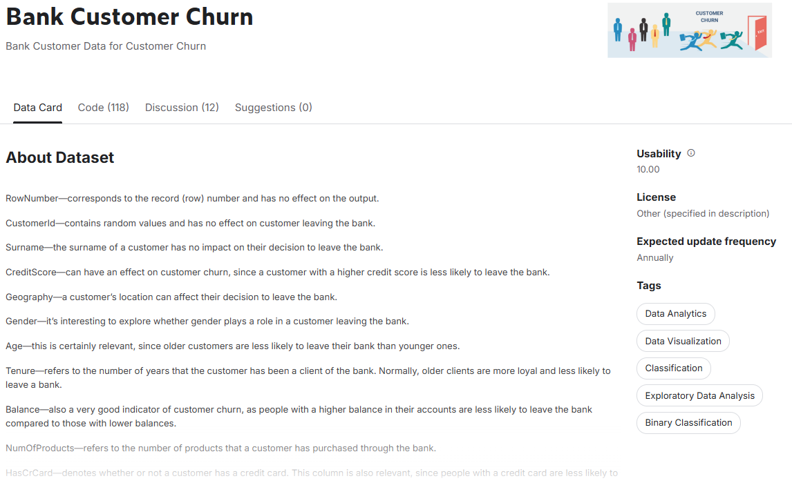
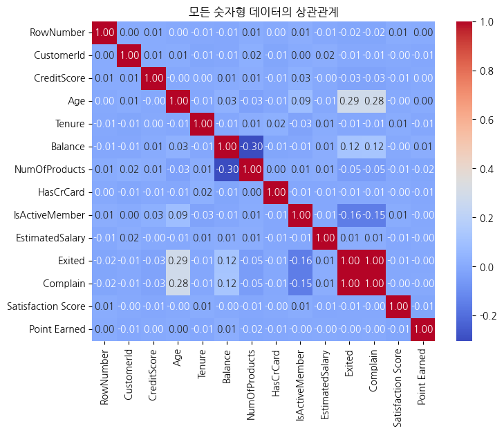
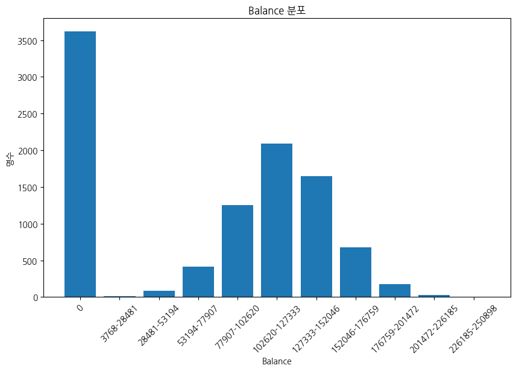

# SKN10-2nd-4Team
# [가입 고객 이탈 예측](https://www.kaggle.com/code/bbksjdd/telco-customer-churn)

---

## 데이터 선정
✅ 데이터 소개: 은행 고객별 이탈 정보

출처: https://www.kaggle.com/datasets/radheshyamkollipara/bank-customer-churn/data

## 데이터 컬럼

|컬럼명|컬럼 설명|컬럼럼 타입|
|---|---|---|
|RowNumber|각 행의 고유 일련 번호|int64|
|CustomerId|고객을 식별하기 위한 고유 번호|object|
|Surname|고객의 성|object|
|CreditScore|고객의 신용 점수|int64|
|Geography|고객의 국가|object|
|Gender|고객의 성별|object|
|Age|고객의 나이|int64|
|Tenure|신용 카드 사용 기간|int64|
|Balance|신용 카드 잔액|float64|
|NumOfProducts|고객이 사용하는 제품 수|int64|
|HasCrCard|고객이 신용 카드를 보유하고 있는지 여부|int64|
|IsActiveMember|고객이 활동적인 회원인지 여부|int64|
|EstimatedSalary|고객의 예상 연봉|float64|
|**Exited**|고객의 이탈 여부|int64|
|Complain|고객 불만 여부|int64|
|Satisfaction Score|불만 해결에 대한 고객 만족도|float64|
|Card Type|신용 카드 종류|object|
|Point Earned|고객이 적립한 포인트|int64|

### 데이터 특징
- 총 10,000명의 고객 데이터, 18개의 컬럼(5개의 object, 13개의 numeric)   
- 결측치 없는 데이터   
- **Exited** 클래스별 분포: 전체 고객 중 약 79.62%는 이탈하지 않은("0") 고객이며, 약 20.38%는 이탈("1") 고객이다.
- 클래스 불균형: 이 결과는 약 4:1의 비율을 나타내어, 어느 정도 불균형이 존재함.
- 분석 관점:
    - 20.38%의 이탈률은 무시할 수 없는 수준으로, 이탈 고객을 대상으로 한 고객 유지 및 마케팅 전략이 중요.
    - 불균형한 데이터는 예측 모델 학습 시 소수 클래스("1")의 예측이 어려울 수 있으므로, 평가 지표로 단순 정확도 대신 F1 스코어나 AUC 등을 고려하고, 오버샘플링, 언더샘플링 등의 샘플링 기법을 적용이 필요해 보임.

## 범주형 데이터와 수치형 데이터 모두 포함한 상관관계 분석 

- Complain과 Exited가 서로 큰 영향을 줘, 해당 컬럼을 포함하여 학습을 진행하면 과적합으로 False Negative(FN)이 과도하게 커질 가능성이 있음.
- 따라서 Complain을 재가공 하거나 해당 컬럼을 제외한 상태로 높은 점수를 얻는 걸 목표로 설정.

### 🔹 **Complain을 제외한 데이터 분석**
- `Exited`와 가장 강한 상관관계는 `Age (+0.29)`로, **고객의 나이가 많을수록 이탈 가능성이 높아지는 경향**이 있음.  
- 음의 상관관계로는 `IsActiveMember (-0.16)`가 가장 크고, **은행을 활용하는 고객이 많아지면 이탈 가능성이 낮아짐**을 알 수 있음.  

- `Balance (+0.12)`은 `Exited`와 괜찮은 상관관계를 갖지만, **`Balance`가 0인 데이터의 비율이 36.17%로 특정 값에 몰려있는 것을 확인 할 수 있음**.

## 프로젝트 방향성   
> 은행의 경우 이탈자를 막기 위해 **고객 특화형 상품을 제시할 것으로 예상**, 따라서 적절한 군집화를 통해 각 군집별로 다른 분석이 필요함을 느낌.

### 군집 기준   
고객의 나이가 많을수록 이탈 가능성이 높다는 데이터 특징을 바탕으로 아래 두가지 군집 기준을 확립   
1. 나이가 많을수록 은행에서는 **추정 소득이 높고 가입 상품이 많은 고객의 이탈을 막기 위해 노력할 것임**.   
2. 나이가 적을수록 은행에서는 **자산이 많고 충성도가 높은 고객의 이탈을 막기 위해 노력할 것임**.

> 2번째 군집에서 충성도가 높다는 기준을 정의   
> - 활동 중인 회원인가
> - 가입 기간이 얼마나 되는가
> - 가입한 금융 상품 수가 몇 개인가
> - 고객의 만족도가 얼마나 높은가
> - 포인트 적립을 많이 하였는가   

해당 정의를 바탕으로 Loyalty_Score 컬럼을 추가

### Complain 컬럼 고려   
군집마다 Complain이 발생하는 기준이 다를 거라 판단하여, 군집을 분류하는 기준 컬럼을 통해 정규화를 수행 후, Complain에 적용하여 Complain_score를 생성   

- 군집 1   
> $Complain score = (5e-5 + Complain) \times \frac{(norm(Age) + norm(EstimatedSalary) + norm(NumOfProducts))}{3}$

- 군집 2
> $Complain score = (5e-5 + Complain) \times \frac{(norm(Age) + norm(EstimatedSalary) + norm(Balance) + norm(Loyalty Score))}{4}$

Complain에 5e-5을 더해주는 이유는 Complain이 0을 차지하는 비중이 너무 크기 때문에 $bias$를 더해주어 의미있는 값으로 변환하기 위함.

### **해당 과정을 통해 군집 별 데이터를 분리하여 두 모델을 학습**